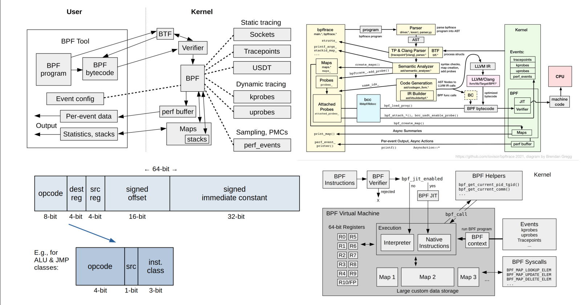

# devtools for epbf

## bpftrace

## ubprobe
- https://lwn.net/Articles/499190/
- uretprobe https://lwn.net/Articles/543924/
## how USDT works
https://leezhenghui.github.io/linux/2019/03/05/exploring-usdt-on-linux.html#heading-linux-tracing-technical-stack
- In authoring time, Using macro DTRACE_PROBE() to delcare a USDT trace point at appropriate souce code location
- During compilation, the source code with USDT trace point will be translated into a nop instruction, in the meanwhile, the USDT metadata will be stored in the ELF's .note.stapstd section.
- When register a probe, USDT tool(usually implemented based on uprobe under the hood) will read the ELF .note.stapstd section, and instrument the instruction from nop to breakpoint(int3 on x86). In such way, whenever control reaches the marker, the interrupt handler for int3 is called, and by turn the uprobe and attached eBPF program get called in kernel to process the events. If the USDT probe associated with semaphores, the front-ends need to incrementing the semaphore’s location via poking /proc/$PID/mem to enable the probe.
- After deregister the probe, USDT will instrument the instruction from breakpoint back to nop, no event get generated anymore, in the meanwhile, decrementing the semaphore's location to detach the current probe.

## BPF CO-RE (Compile Once – Run Everywhere)

### protability problem
1. BPF programs do not control memory layout of a surrounding kernel environment.
2. kernel data structure changes

__sk_buf field 下划线版本 提供了一个稳定的view版本

BCC 采用内置的CLang和本机内置的header file 即时编译，这样解决了内存布局问题，
并且可以用#ifdef/#else做条件编译，但是有一些问题
1.Clang/LLVM combo is a big library, 编译后二进制文件过大
2.Clang/LLVM combo 编译占用资源比较大，增大prod主机的负载
3.Target主机头文件不存在
4.测试和开发过程痛苦

### High-level BPF CO-RE mechanics
- BTF type information, which allows to capture crucial pieces of information about kernel and BPF program types and code, enabling all the other parts of BPF CO-RE puzzle;

- compiler (Clang) provides means for BPF program C code to express the intent and record relocation information; BTF relocations 

- BPF loader (libbpf) ties BTFs from kernel and BPF program together to adjust compiled BPF code to specific kernel on target hosts;

- kernel, while staying completely BPF CO-RE-agnostic, provides advanced BPF features to enable some of the more advanced scenarios.

### BCC to Libbpf
https://www.pingcap.com/blog/tips-and-tricks-for-writing-linux-bpf-applications-with-libbpf/

### profile 程序
- blazesym_symbolize() 函数将栈中的地址解析为符号名和源代码位置

### 统计TCP延时
- tcpconnlat https://eunomia.dev/zh/tutorials/13-tcpconnlat/#_1
- 几个主要的跟踪点：tcp_v4_connect, tcp_v6_connect 和 tcp_rcv_state_process。
- tcp fast open https://juejin.cn/post/7152904835342270472

### TCP State
sock/inet_sock_set_state这个内核 tracepoint 上。每当 TCP 连接状态发生变化时，这个 tracepoint 就会被触发，然后执行handle_set_state函数

### TCP RTT
SEC("fentry/tcp_rcv_established")
- 根据过滤条件对 TCP 连接进行过滤。
- 在hists map 中查找或者初始化对应的 histogram。
- 读取 TCP 连接的srtt_us字段，并将其转换为对数形式，存储到 histogram 中。
- 如果设置了show_ext参数，将 RTT 值和计数器累加到 histogram 的latency和cnt字段中。

### libbpf-bootstrap
https://nakryiko.com/posts/libbpf-bootstrap/

### java gc
- usdt
```
   skel->links.handle_mem_pool_gc_start = bpf_program__attach_usdt(skel->progs.handle_gc_start, env.pid,
                                    binary_path, "hotspot", "mem__pool__gc__begin", NULL);
    if (!skel->links.handle_mem_pool_gc_start) {
        err = errno;
        fprintf(stderr, "attach usdt mem__pool__gc__begin failed: %s\n", strerror(err));
        goto cleanup;
    }

    skel->links.handle_mem_pool_gc_end = bpf_program__attach_usdt(skel->progs.handle_gc_end, env.pid,
                                binary_path, "hotspot", "mem__pool__gc__end", NULL);
    if (!skel->links.handle_mem_pool_gc_end) {
        err = errno;
        fprintf(stderr, "attach usdt mem__pool__gc__end failed: %s\n", strerror(err));
        goto cleanup;
    }

```
### LSM 安全
- SEC("lsm/socket_connect") 宏指出该程序期望的挂载点

### tc流量控制
-  SEC("tc")

### XDP
- SEC("xdp")

### HTTP协议追踪
两种思路
#### Socket Filter
- SEC("socket")
- 用户态代码的主要目的是创建一个原始套接字（raw socket），然后将先前在内核中定义的eBPF程序附加到该套接字上，从而允许eBPF程序捕获和处理从该套接字接收到的网络数据包,例如：
```
/* Create raw socket for localhost interface */
    sock = open_raw_sock(interface);
    if (sock < 0) {
        err = -2;
        fprintf(stderr, "Failed to open raw socket\n");
        goto cleanup;
    }

    /* Attach BPF program to raw socket */
    prog_fd = bpf_program__fd(skel->progs.socket_handler);
    if (setsockopt(sock, SOL_SOCKET, SO_ATTACH_BPF, &prog_fd, sizeof(prog_fd))) {
        err = -3;
        fprintf(stderr, "Failed to attach to raw socket\n");
        goto cleanup;
    }
```
#### Syscall 
- SEC("tracepoint/syscalls/sys_enter_accept")
- SEC("tracepoint/syscalls/sys_exit_accept")
- SEC("tracepoint/syscalls/sys_enter_read")
- SEC("tracepoint/syscalls/sys_exit_read")
sys_enter_accept：定义在accept系统调用的入口处，用于捕获accept系统调用的参数，并将它们存储在哈希映射中。
sys_exit_accept：定义在accept系统调用的退出处，用于处理accept系统调用的结果，包括获取和存储新的套接字文件描述符以及建立连接的相关信息。
sys_enter_read：定义在read系统调用的入口处，用于捕获read系统调用的参数，并将它们存储在哈希映射中。
sys_exit_read：定义在read系统调用的退出处，用于处理read系统调用的结果，包括检查读取的数据是否为HTTP流量，如果是，则发送事件。

在sys_exit_accept和sys_exit_read中，还涉及一些数据处理和事件发送的逻辑，例如检查数据是否为HTTP连接，组装事件数据，并使用bpf_perf_event_output将事件发送到用户空间供进一步处理。


### sockops 加速网络请求转发
- https://preliminary.istio.io/latest/zh/blog/2022/merbridge/
- bpf_contrack.bpf.c 中的 BPF 代码定义了一个套接字操作（sockops）程序，它的功能主要是当本机（使用 localhost）上的任意 TCP 连接被创建时，根据这个新连接的五元组（源地址，目标地址，源端口，目标端口，协议），在 sock_ops_map 这个 BPF MAP 中创建一个条目。这个 BPF MAP 被定义为 BPF_MAP_TYPE_SOCKHASH 类型，可以存储套接字和对应的五元组。这样使得每当本地 TCP 连接被创建的时候，这个连接的五元组信息也能够在 BPF MAP 中找到。

- bpf_redirect.bpf.c 中的 BPF 代码定义了一个网络消息 (sk_msg) 处理程序，当本地套接字上有消息到达时会调用这个程序。然后这个 sk_msg 程序检查该消息是否来自本地地址，如果是，根据获取的五元组信息（源地址，目标地址，源端口，目标端口，协议）在 sock_ops_map 查找相应的套接字，并将该消息重定向到在 sock_ops_map 中找到的套接字上，这样就实现了绕过内核网络栈。

### uprobe 捕获多种库的 SSL/TLS 明文数据
- SEC("uretprobe/SSL_read")
- SEC("uretprobe/SSL_write")
- SEC("uprobe/do_handshake")
- SEC("uretprobe/do_handshake")

### 测量函数延迟
- 使用 kprobes 和 kretprobes（用于内核函数）或 uprobes 和 uretprobes（用于用户空间函数）
